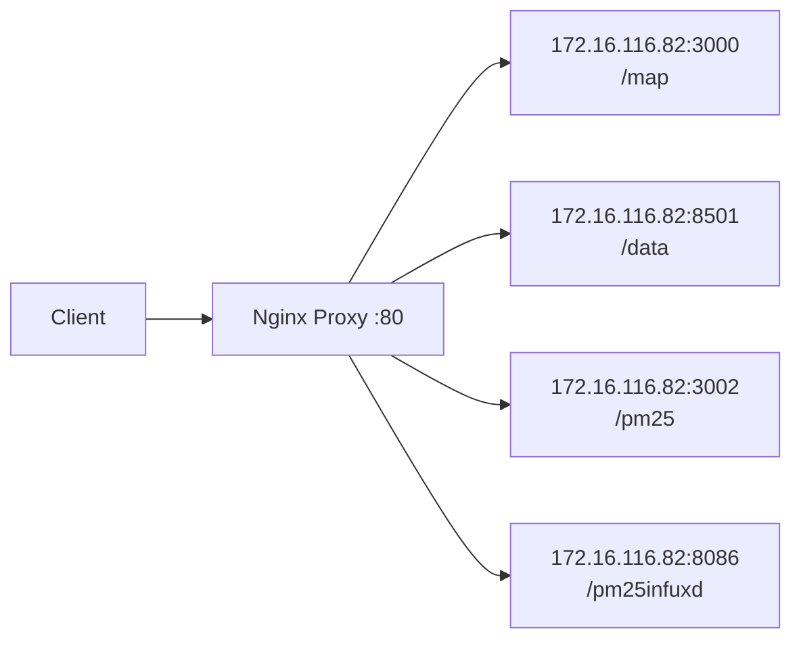

# Design Document: Nginx Reverse Proxy

## Overview

This design implements a Docker Compose-based Nginx reverse proxy that routes HTTP requests from specific URL paths to backend services running on different ports within the 172.16.116.82 network. The solution provides a single entry point for multiple services while maintaining clean, memorable URLs.

## Architecture

The system consists of two main components:

1. **Nginx Reverse Proxy Container**: A containerized Nginx instance that handles incoming HTTP requests and forwards them to appropriate backend services
2. **Docker Compose Orchestration**: Configuration that manages the Nginx container, networking, and volume mounts



## Components and Interfaces

### Docker Compose Configuration

**File**: `docker-compose.yml`
- Defines the Nginx service with official nginx:alpine image
- Configures port mapping (80:80) for HTTP access
- Mounts custom Nginx configuration file
- Sets up networking to reach external services on 172.16.116.82

### Nginx Configuration

**File**: `nginx.conf`
- Defines server block listening on port 80
- Implements location blocks for each path mapping:
  - `/map/` → `http://172.16.116.82:3000/`
  - `/data/` → `http://172.16.116.82:8501/`
  - `/pm25/` → `http://172.16.116.82:3002/`
  - `/pm25infuxd/` → `http://172.16.116.82:8086/`
- Configures proxy headers for proper backend communication
- Includes error handling and logging

### Network Configuration

The solution uses Docker's default bridge network with additional configuration to allow the Nginx container to communicate with services on the 172.16.116.82 network. This may require:
- Host networking mode, or
- Custom network configuration with external network access

## Data Models

### Proxy Configuration Structure

```
ProxyRule {
  path: string          // URL path pattern (e.g., "/map")
  upstream: string      // Backend service URL (e.g., "http://172.16.116.82:3000")
  headers: object       // Additional proxy headers
}
```

### Service Mappings

```
ServiceMappings = [
  { path: "/map", upstream: "http://172.16.116.82:3000" },
  { path: "/data", upstream: "http://172.16.116.82:8501" },
  { path: "/pm25", upstream: "http://172.16.116.82:3002" },
  { path: "/pm25infuxd", upstream: "http://172.16.116.82:8086" }
]
```

## Correctness Properties

*A property is a characteristic or behavior that should hold true across all valid executions of a system-essentially, a formal statement about what the system should do. Properties serve as the bridge between human-readable specifications and machine-verifiable correctness guarantees.*

### Property 1: Path Routing Consistency
*For any* HTTP request to a defined path (/map, /data, /pm25, /pm25infuxd), the Nginx proxy should forward the request to the correct backend service according to the path mapping configuration
**Validates: Requirements 2.1, 2.2, 2.3, 2.4**

### Property 2: Error Handling for Unavailable Services
*For any* backend service that becomes unavailable, requests to its corresponding path should return a 502 Bad Gateway error
**Validates: Requirements 3.3, 5.1**

### Property 3: Error Handling for Undefined Paths
*For any* HTTP request to a path that is not defined in the configuration, the Nginx proxy should return a 404 Not Found error
**Validates: Requirements 5.2**

### Property 4: Header Preservation and Proxy Headers
*For any* HTTP request that matches a defined path, the Nginx proxy should preserve all original request headers and add appropriate proxy headers for backend communication
**Validates: Requirements 4.4**

## Error Handling

The system implements comprehensive error handling at multiple levels:

### Network-Level Errors
- **Connection Failures**: When backend services are unreachable, Nginx returns 502 Bad Gateway
- **Timeout Handling**: Configurable timeouts for backend connections with appropriate error responses
- **DNS Resolution**: Proper handling of hostname resolution failures

### Application-Level Errors
- **Path Not Found**: 404 responses for requests to undefined paths
- **Method Not Allowed**: Appropriate HTTP status codes for unsupported methods
- **Request Size Limits**: Configurable limits with proper error responses

### Logging and Monitoring
- **Access Logs**: All requests logged with timestamp, path, response code, and response time
- **Error Logs**: Detailed error information for debugging and monitoring
- **Health Checks**: Optional health check endpoints for monitoring system status

## Testing Strategy

The testing approach combines configuration validation, integration testing, and property-based testing to ensure comprehensive coverage.

### Configuration Testing
- **Docker Compose Validation**: Verify compose file syntax and service definitions
- **Nginx Configuration Validation**: Test nginx.conf syntax and location block definitions
- **Network Configuration**: Validate network settings and connectivity options

### Integration Testing
- **End-to-End Request Flow**: Test complete request routing from client to backend
- **Service Discovery**: Verify proxy can reach all configured backend services
- **Error Scenarios**: Test behavior when backends are unavailable

### Property-Based Testing
Property-based tests will validate universal behaviors across many generated inputs:
- **Routing Properties**: Test path routing with various request types and headers
- **Error Handling Properties**: Test error responses with different failure scenarios
- **Header Handling Properties**: Verify header preservation and proxy header addition

Each property test will run a minimum of 100 iterations to ensure comprehensive coverage through randomization. Tests will be tagged with format: **Feature: nginx-reverse-proxy, Property {number}: {property_text}**

### Unit Testing Balance
- **Configuration Examples**: Test specific configuration scenarios and edge cases
- **Integration Points**: Test Docker Compose service startup and networking
- **Error Conditions**: Test specific error scenarios and logging functionality
- **Property Tests**: Verify universal properties across all valid inputs

Both unit tests and property tests are complementary and necessary for comprehensive coverage. Unit tests catch concrete configuration issues, while property tests verify general correctness across all possible inputs.